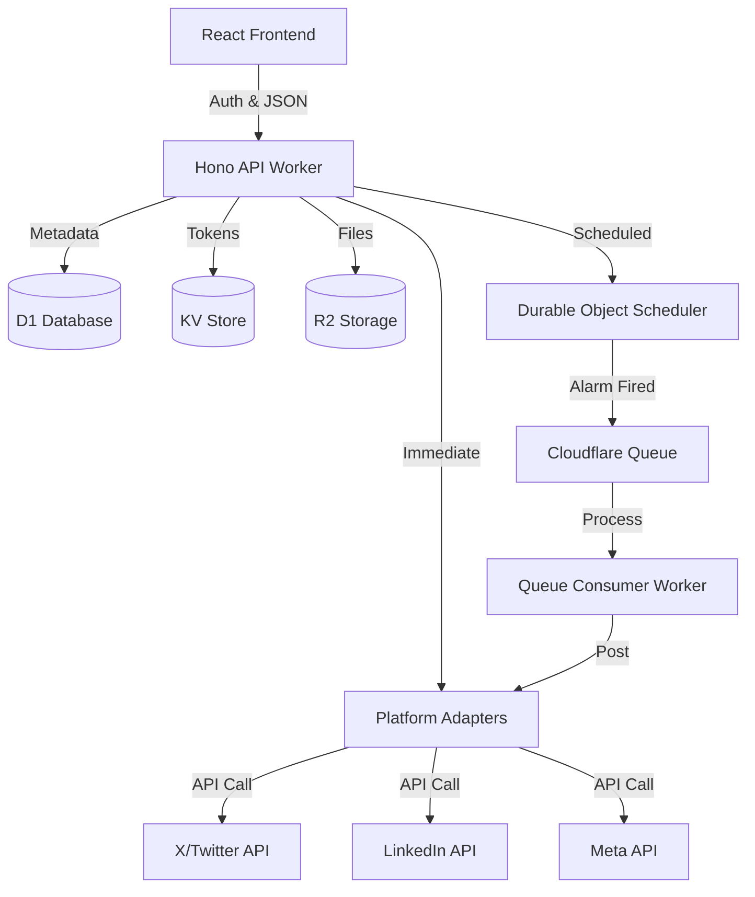

# Unified Social Media Publishing SaaS

A production-ready, scalable social media publishing engine built on Cloudflare Workers, D1, KV, R2, and Queues.

## Architecture Diagram



## Features

- **Unified Dashboard**: Track status across multiple platforms in real-time.
- **Precision Scheduling**: Native Durable Object alarms for high-accuracy posting.
- **Asynchronous Engine**: Cloudflare Queues ensure reliable delivery even under high load.
- **Media Management**: Direct R2 integration for high-performance image handling.
- **AI-Powered**: Integrated with Cloudflare Workers AI for content optimization.

## Setup Instructions

1.  **Clone the repository**
2.  **Backend Setup**:
    - `cd backend`
    - `npm install`
    - Create `.dev.vars` with your API keys:
      ```
      X_API_KEY=...
      X_API_SECRET=...
      X_ACCESS_TOKEN=...
      X_ACCESS_SECRET=...
      LINKEDIN_CLIENT_ID=...
      LINKEDIN_CLIENT_SECRET=...
      JWT_SECRET=...
      ```
    - Initialize Database: `npx wrangler d1 execute social_publishing_db --local --file=./schema.sql`
3.  **Frontend Setup**:
    - `cd frontend`
    - `npm install`
    - `npm run dev`

## Environment Variables

| Variable | Description |
|---|---|
| `X_API_KEY` | Twitter/X API Consumer Key |
| `X_API_SECRET` | Twitter/X API Consumer Secret |
| `X_ACCESS_TOKEN` | Twitter/X API Access Token |
| `X_ACCESS_SECRET` | Twitter/X API Access Token Secret |
| `JWT_SECRET` | Secret key for signing local auth tokens |

## Adding a New Platform Adapter

To add a new platform (e.g., Pinterest):

1.  Create `src/platforms/pinterest.ts` implementing the `PlatformAdapter` interface:
    ```typescript
    export class PinterestAdapter implements PlatformAdapter {
      async authenticate(creds: any): Promise<boolean> { ... }
      async publish(params: PublishParams): Promise<any> { ... }
      async getStatus(id: string, creds: any): Promise<any> { ... }
    }
    ```
2.  Register the adapter in `src/platforms/index.ts` within the `PlatformIntegrationFactory`.
3.  Add the platform name to the frontend `availablePlatforms` list in `CreatePostPage`.

## Status Tracking & Retries

The system tracks status at both the **Post** level (Overall) and **Platform** level.
If a platform-specific publish fails, it can be retried manually from the dashboard or automatically via Cloudflare Queue retries.
Detailed error logs and raw API responses are stored in the `PostPlatforms` table for debugging.
